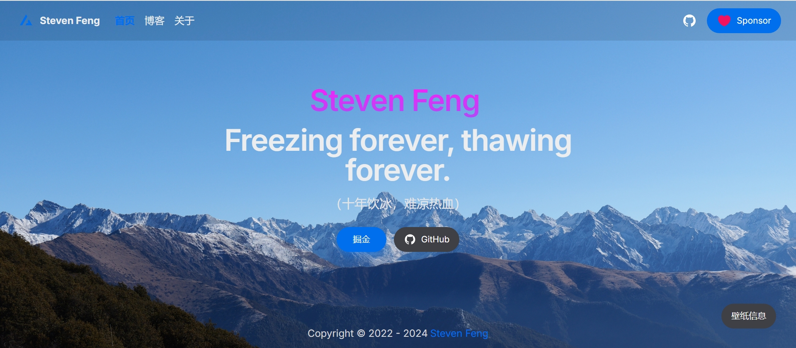

<p align="center">
  <a href="https://stevenfeng.cn" target="_blank" rel="noopener noreferrer">
    
  </a>
</p>

<h1 align="center"/>个人主页 <sup><em>alpha</em></sup></h1>

<br/>
<p align="center">
  <a href="https://github.com/fh332393900/my-next/actions"></a>
  <a href="https://github.com/fh332393900/my-next/blob/master/package.json"></a>
</p>
<br/>

## 技术栈

- [Next.js 14](https://nextjs.org/docs/getting-started)
- [NextUI v2](https://nextui.org/)
- [Tailwind CSS](https://tailwindcss.com/)
- [Tailwind Variants](https://tailwind-variants.org)
- [TypeScript](https://www.typescriptlang.org/)
- [Framer Motion](https://www.framer.com/motion/)
- [next-themes](https://github.com/pacocoursey/next-themes)
- [framer-motion](https://www.framer.com/motion/)

## 如何使用

### 安装依赖

```bash
npm install
```

### 本地运行

```bash
npm run dev
```

## 使用协议

Licensed under the [MIT license](https://github.com/nextui-org/next-app-template/blob/main/LICENSE).
